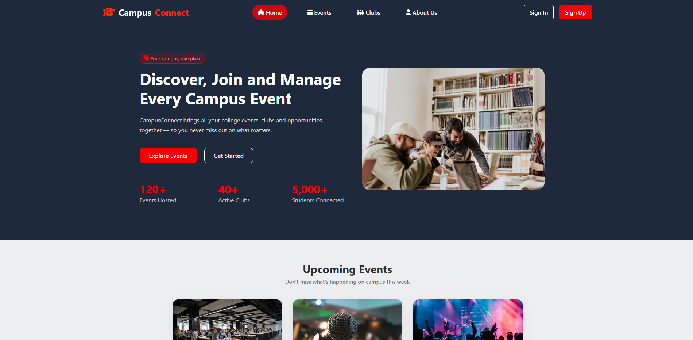
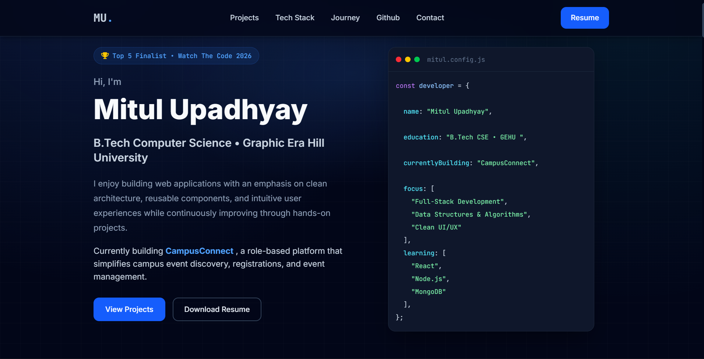

<!--  TOP BANNER  -->

<!--  HERO / TYPING SVG  -->

<!--  QUICK LINKS  -->

  
  
  
  

 

<!--  ABOUT + GIF  -->
<table width="100%">
<tr>
<td width="58%" valign="middle">

### 👋 About Me

**B.Tech CSE student** at Graphic Era Hill University, focused on full-stack web development and building things people actually use.

- 🚧 Building **CampusConnect** — an AI-powered campus event platform
- 📚 Strengthening **DSA fundamentals** in C++
- 🎯 Preparing for a **Summer 2027 SWE Internship**
- 🌐 **[mitul.is-a.dev](https://mitul.is-a.dev)**

</td>
<td width="42%" align="center">

</td>
</tr>
</table>

 

## 🛠️ Tech Stack

<b>LANGUAGES</b> 

  

<b>FRONTEND</b> 

  

<b>TOOLS</b> 

 

## 🚀 Featured Projects

<table width="100%">
<tr>
<td width="50%" valign="top">

**🎓 CampusConnect**
 
AI-powered campus event management platform with a responsive UI and full event lifecycle management.

- Responsive, modern UI
- End-to-end event management flow
- AI-assisted features

  
  

</td>
<td width="50%" valign="top">

**🌐 Personal Portfolio**
 
A modern, minimal portfolio website showcasing my projects, skills, and journey.

- Clean, recruiter-friendly design
- Built with HTML, CSS, Tailwind & JS

  
  

</td>
</tr>
</table>

 

## 📊 GitHub Statistics

 

## 📈 Contribution Activity

  

 

## 🔭 Current Focus

<table width="100%">
<tr>
<td align="center">

🔭 Building the **CampusConnect** backend &nbsp;|&nbsp;
📚 Learning **Backend Development** &nbsp;|&nbsp;
🧠 Solving **DSA problems in C++** &nbsp;|&nbsp;
🚀 Preparing for **Summer 2027 SWE Internships**

</td>
</tr>
</table>

 

## 📬 Connect

 

